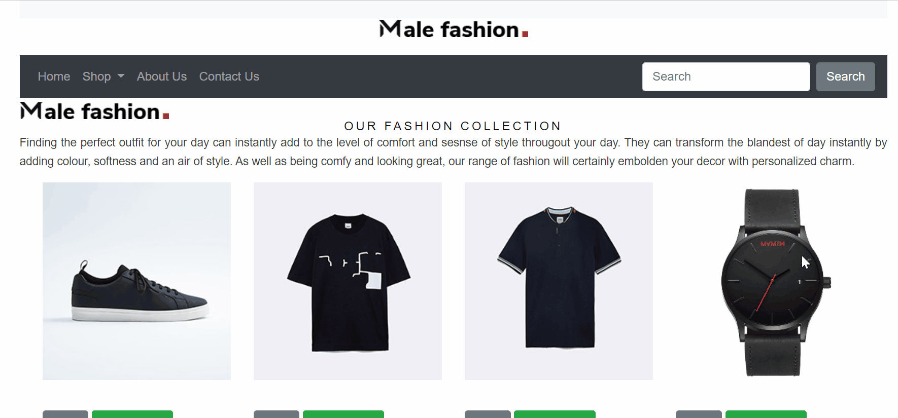
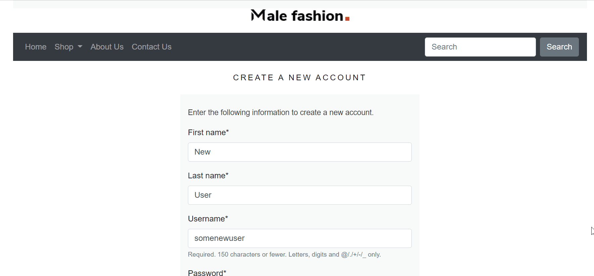

# Frontend E-commerce Website | Web Application 

#### Check out the live site:

![Live-Site]<https://awecommerceapp.herokuapp.com/>
## Background

The purpose of this project is to build a full stack web application that will give small business owners full visibility of sales, and inventory. Additionally, amidst the devastation of covid-19 and mandatory social distancing the ability to sell goods and services online is essential. 

## Overview

This fully responsive e-commerce website was built in Python's Django framework

## Application Features

### Featured Products

Check out the best sellers, hot sales, and new arrivals

### Shop Products

View all products at once or shop by category

### Search for Products

Checkout the handy search feature !

### Become a member

Signup and login as a member to view past order history

